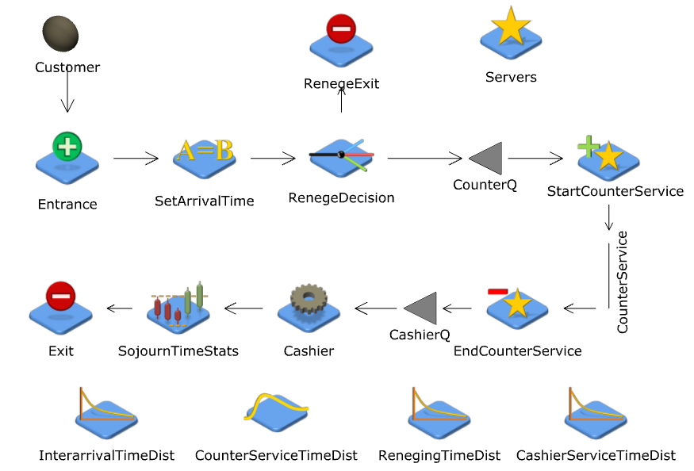

```{r setup, echo = FALSE, include = FALSE}
# Load packages
library(readxl)
library(fitdistrplus)
library(dplyr)
library(knitr)
library(ggplot2)
```

# Problem statement

In this study, we use simulation to analyze the Annapolis Ice Cream Company, a small, popular ice cream shop located in Downtown Annapolis. When customers enter the shop, they wait to be helped by an ice cream server at the counter. Once they have been served, they then wait to be rung up by the cashier. Since there is no sitting area, after customers are done with the cashier, they leave the shop. Customers are processed by the servers and the cashier on a first-in, first-out (FIFO) basis. The shop is open from 10:00 to 22:00 every day. 

The manager of the Annapolis Ice Cream Company has provided historical data on interarrival times, ice cream service times, and cashier serivce times on Saturday afternoons in the summer, the shop's busiest time. The manager has also indicated that she has observed that customers often leave the counter line if they wait too long. She estimates that the threshold is about 10 minutes. 

At the request of the manager, we study how the number of employees on duty affect the customer experience at the Annapolis Ice Cream Company. She has two objectives: she would like to serve customers quickly, but she would also like the shop to appear busy to project that the shop is popular. To this end, we examine the effect of the number of servers on two performance measures: (1) the average sojourn time of customers in the shop and (2) the time average number of customers waiting in the shop (that is, either at the counter or the cashier). We focus on the number of servers at the counter because the shop only has enough room for one cash register and therefore one cashier. On the other hand, the counter can comfortably fit up to three servers who can then serve customers simultaneously. 

# Input data analysis

```{r echo = FALSE, include = FALSE}
# Read data from Excel file
data <- read_excel('data.xlsx', 
                   range = 'saturday!A2:C101', 
                   col_names = c('interarrival.time', 'scoop.time', 'cashier.time'))
```

## Interarrival times

```{r echo = FALSE, include = FALSE}
# Inspect data 
# This plot is just for investigative purposes, and will be hidden in the final report
# To see this plot, set include to TRUE above and re-run this chunk
plotdist(data$interarrival.time)
```

```{r echo = FALSE, include = FALSE}
# Find maximum likelihood estimator for exponential and gamma distributions
interarrival.fit.exp <- fitdist(data$interarrival.time, "exp")
summary(interarrival.fit.exp)

interarrival.fit.gamma <- fitdist(data$interarrival.time, "gamma")
summary(interarrival.fit.gamma)
```

First, we consider the time between customer arrivals. This time data was given in minutes. After inspecting the data visually, we determined that the interarrival times may be appropriately modeled by an exponential or gamma distribution.

The histogram of the interarrival time data and the probability density functions of the fitted distributions are shown on the left below.
Similarly, the empirical cumulative distribution function of the interarrival time data and the theoretical cumulative distribution functions of the fitted distributions are shown on the right below. 

```{r echo = FALSE, out.width='3.25in'}
# Plot histogram and theoretical densities
denscomp(list(interarrival.fit.exp,  interarrival.fit.gamma),
         legendtext = c('exponential', 'gamma'), 
         plotstyle = 'ggplot') +
  theme(legend.position="bottom")
# Plot empirical and theoretical cdfs
cdfcomp(list(interarrival.fit.exp,  interarrival.fit.gamma), 
        legendtext = c('exponential', 'gamma'), 
        plotstyle = 'ggplot') + 
  theme(legend.position="bottom")
```

In addition, the goodness-of-fit statistics for these fitted distributions are given in the tables below:

```{r echo = FALSE}
# Compute goodness-of-fit statistics
interarrival.gof <- gofstat(list(interarrival.fit.exp,  interarrival.fit.gamma), 
                            fitnames = c('exponential', 'gamma'))
```

|                              | Exponential                             | Gamma                             |
| -----------------------------| --------------------------------------: | --------------------------------: |
| Kolmogorov-Smirnov statistic | `r interarrival.gof$ks['exponential']`  | `r interarrival.gof$ks['gamma']`  |
| AIC                          | `r interarrival.gof$aic['exponential']` | `r interarrival.gof$aic['gamma']` |
| BIC                          | `r interarrival.gof$bic['exponential']` | `r interarrival.gof$bic['gamma']` |

From the graphs above, we see that the exponential and gamma distributions appear to be good fits to the interarrival time data. Furthermore, as we see in the table above, among the three distributions, the gamma distribution has the better K-S statistic, while the exponential distribution has the better AIC and BIC.  So, for our simulation study, we chose to model the interarrival times with the exponential distribution. 

## Counter service times

```{r echo = FALSE, include = FALSE}
# Inspect data 
# This plot is just for investigative purposes, and will be hidden in the final report
# To see this plot, set include to TRUE above and re-run this chunk
plotdist(data$scoop.time)
```

Next, we consider the time it takes to serve a customer at the counter. This time data was given in minutes. After inspecting the data visually, we determined that the counter service times may be appropriately modeled by a gamma or normal distribution.

```{r echo = FALSE, include = FALSE}
# Find maximum likelihood estimator for gamma and normal distributions
scoop.fit.gamma <- fitdist(data$scoop.time, "gamma")
summary(scoop.fit.gamma)

scoop.fit.norm <- fitdist(data$scoop.time, "norm")
summary(scoop.fit.norm)
```

Using maximum likelihood estimation, the cashier times best fit

* a gamma distribution with shape `r scoop.fit.gamma$estimate['shape']` and rate `r scoop.fit.gamma$estimate['rate']`, and
* a normal distribution with mean `r scoop.fit.norm$estimate['mean']` and standard deviation `r scoop.fit.norm$estimate['sd']`.

The histogram of the counter service time data and the probability density functions of the fitted distributions are shown on the left below. Similarly, the empirical cumulative distribution function of the counter service time data and the theoretical cumulative distribution functions of the fitted distributions are shown on the right below. 

```{r echo = FALSE, out.width='3.25in'}
# Plot histogram and theoretical densities
denscomp(list(scoop.fit.gamma, scoop.fit.norm), 
         legendtext = c('gamma', 'normal'), 
         plotstyle = 'ggplot') + 
  theme(legend.position = "bottom")
# Plot empirical and theoretical cdfs
cdfcomp(list(scoop.fit.gamma, scoop.fit.norm), 
        legendtext = c('gamma', 'normal'), 
        plotstyle = 'ggplot') + 
  theme(legend.position = "bottom")
```

In addition, the goodness-of-fit statistics for these fitted distributions are given in the tables below:

```{r echo = FALSE, include = FALSE}
# Compute goodness-of-fit statistics 
scoop.gof <- gofstat(list(scoop.fit.gamma, scoop.fit.norm), 
                     fitnames = c('gamma', 'normal'))
```

|                              | Gamma                        | Normal                           |
| -----------------------------| ---------------------------: |--------------------------------: |
| Kolmogorov-Smirnov statistic | `r scoop.gof$ks['gamma']`    | `r scoop.gof$ks['normal']`       |
| AIC                          | `r scoop.gof$aic['gamma']`   | `r scoop.gof$aic['normal']`      |
| BIC                          | `r scoop.gof$bic['gamma']`   | `r scoop.gof$bic['normal']`      |

From the graphs above, we see that the gamma distribution appears to be a better fit than the normal distribution. Furthermore, as we see in the table above, between the two distributions, the gamma distribution has the better AIC, BIC, and K-S statistic.  So, for our simulation study, we chose to model the counter service times with the gamma distribution with shape `r scoop.fit.gamma$estimate['shape']` and rate `r scoop.fit.gamma$estimate['rate']`.

### Cashier service times

```{r echo = FALSE, include = FALSE}
# Inspect data 
# This plot is just for investigative purposes, and will be hidden in the final report
# To see this plot, set include to TRUE above and re-run this chunk
plotdist(data$cashier.time)
```

Next, we consider the time each customer spends at the cashier. This time data was given in minutes. After inspecting the data visually, we determined that the cashier service times may be appropriately modeled by a gamma or exponential distribution.

```{r echo = FALSE, include = FALSE}
# Find maximum likelihood estimator for gamma and exponential distributions
cashier.fit.gamma <- fitdist(data$cashier.time, "gamma")
summary(cashier.fit.gamma)

cashier.fit.exp <- fitdist(data$cashier.time, "exp")
summary(cashier.fit.exp)
```

Using maximum likelihood estimation, the cashier service times best fit

* a gamma distribution with shape `r cashier.fit.gamma$estimate['shape']` and rate `r cashier.fit.gamma$estimate['rate']`, and
* an exponential distribution with rate `r cashier.fit.exp$estimate['rate']`.

The histogram of the cashier service time data and the probability density functions of the fitted distributions are shown on the left below. The empirical cumulative distribution function of the cashier service time data and the theoretical cumulative distribution functions of the fitted distributions are shown on the right below. 

```{r echo = FALSE, out.width='3.25in'}
# Plot histogram and theoretical densities
denscomp(list(cashier.fit.gamma, cashier.fit.exp), 
         legendtext = c('gamma', 'exponential'), 
         plotstyle = 'ggplot') + 
  theme(legend.position = "bottom")
# Plot empirical and theoretical cdfs
cdfcomp(list(cashier.fit.gamma, cashier.fit.exp), 
        legendtext = c('gamma', 'exponential'), 
        plotstyle = 'ggplot') +
  theme(legend.position = "bottom")
```

In addition, the goodness-of-fit statistics for these fitted distributions are given in the tables below:

```{r echo = FALSE, include = FALSE}
# Compute goodness-of-fit statistics 
cashier.gof <- gofstat(list(cashier.fit.gamma, cashier.fit.exp), 
                       fitnames = c('gamma', 'exponential'))
```

|                              | Gamma                        | Exponential |
| -----------------------------| ---------------------------: |--------------------------------: |
| Kolmogorov-Smirnov statistic | `r cashier.gof$ks['gamma']`  | `r cashier.gof$ks['exponential']`  |
| AIC                          | `r cashier.gof$aic['gamma']` | `r cashier.gof$aic['exponential']` |
| BIC                          | `r cashier.gof$bic['gamma']` | `r cashier.gof$bic['exponential']` |

From the graphs above, we see that both the gamma and exponential distributions appear to be reasonable choices. Furthermore, as we see in the table above, between the two distributions, the exponential distribution has the better AIC, BIC, and K-S statistic.  So, for our simulation study, we chose to model the cashier service times with the exponential distribution with rate `r cashier.fit.exp$estimate['rate']`.

## Reneging times

Unfortunately, we have limited information about the time customers are willing to wait until they leave the line, or renege. The manager estimates that this reneging time is approximately 10 minutes. Instead of using a deterministic threshold, we model the reneging time as a probability distribution to capture the different attitudes customers can have towards waiting in line.  For the purposes of our simulation study, we assume the reneging times follow an exponential distribution with a mean of 10 minutes. Although this is a strong assumption that would ideally be verified with actual data, it is a reasonable assumption since the exponential distribution is often used to model phenomena in queueing systems such as waiting and reneging. 

# Simulation model and experiment setup

We modeled the Annapolis Ice Cream Company in JaamSim, following the description of how the shop operates, above in the problem statement. A graphical representation of the simulation model is shown below. 

```{r echo = FALSE, out.width='4.5in', fig.pos='h', fig.align='center'}

```

Using this simulation model, we examined two performance measures -- the average sojourn time of the customers in the shop and the time average total number of customers waiting at either the counter or the cashier -- when there are 1, 2, and 3 servers at the counter.

```{r echo = FALSE, include = FALSE}
# Run JaamSim model
system('java -jar "/Applications/JaamSim/JaamSim2017-09.jar" "simulation.cfg" -b')
```

# Simulation output analysis

```{r echo = FALSE, include = FALSE}
# Read output from simulation
output <- read.table("simulation.dat",
                     sep="\t", skip=3, 
                     col.names=c('number.of.servers', 'run', 'counter.avg.qlength',
                                 'cashier.avg.qlength', 'avg.sojourn.time'))

output <- output %>%
  mutate(total.avg.qlength = counter.avg.qlength + cashier.avg.qlength)

# Summarize output data
summary <- output %>%
  group_by(number.of.servers) %>%
  summarise(mean.avg.sojourn.time = mean(avg.sojourn.time), 
            sojourn.ci.range = 2*1.96*sd(avg.sojourn.time)/sqrt(n()),
            mean.total.avg.qlength = mean(total.avg.qlength), 
            qlength.ci.range = 2*1.96*sd(total.avg.qlength)/sqrt(n())) 
```

## Average sojourn time

The table below shows the average sojourn time of customers when there are 1, 2, and 3 servers in the shop. The table also includes the corresponding 95% confidence interval lengths. As we see in the table, as the number of servers increases, the sojourn time decreases. The lengths of the 95% confidence intervals are zero for all numbers of baristas, suggesting that our predictions are precise.

```{r echo = FALSE}
summary %>%
  select(number.of.servers, mean.avg.sojourn.time, sojourn.ci.range)  %>%
  kable(col.names = c('Number of servers', 'Average sojourn time (minutes)', '95% CI length'))
```

## Time average number of customers waiting

The table below shows the predicted mean of the time average number of customers waiting at either the counter or the cashier, when there are 1, 2, and 3 servers in the shop. The table also includes the corresponding 95% confidence interval lengths. As we see in the table, as the number of servers increases, the predicted mean of the time average number of customers waiting decreases. The lengths of the 95% confidence intervals are zero for all numbers of baristas, suggesting that our predictions are precise.

```{r echo = FALSE}
summary %>%
  select(number.of.servers, mean.total.avg.qlength, qlength.ci.range)  %>%
  kable(col.names = c('Number of servers', 'Time avg. number of customers waiting (predicted mean)', '95% CI length'))
```

## Tradeoff between performance measures

The graph below shows our simulation's predictions of the mean average sojourn time plotted against the mean time average number of customers waiting when there are 1, 2, and 3 servers in the shop. 
As we saw in the tables above, as the number of servers increases, both performance measures decrease. 

```{r echo=FALSE, include=TRUE, out.width='4.5in', fig.align='center'}
ggplot(summary) + 
  geom_line(aes(x = mean.avg.sojourn.time, y = mean.total.avg.qlength)) +
  geom_point(aes(x = mean.avg.sojourn.time, y = mean.total.avg.qlength,
                 color=factor(number.of.servers))) + 
  labs(title = paste("Average sojourn time vs.",
                     "time average number of customers waiting\n",
                     "(predicted means)"),
       x = "Average sojourn time",
       y = "Time avg. number of customers waiting",
       color = "Number of servers")
```

# Conclusion

Based on our simulation study, it is clear that having two servers is the optimal solution. Increasing the number of servers from 1 to 2 had the largest effect in both average sojourn time and time average number of customers waiting. However, increasing the number of servers from 2 to 3 had only a minimal effect on the two performance measures. 
Furthermore, as seen above in the simulation output analysis section, the predictions of our simulation study are reliable.
